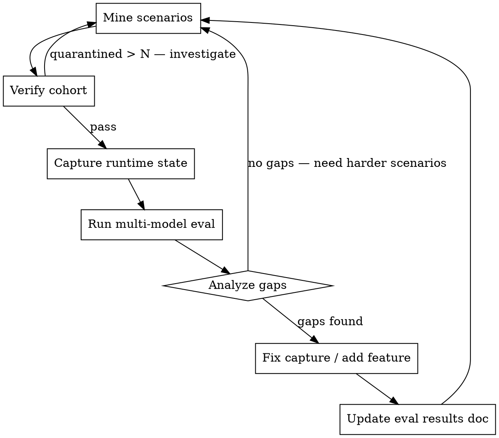

<!--
  This is a reference copy. The active skill lives at:
  ~/.claude/skills/eval-driven-improvement/SKILL.md
-->
---
name: eval-driven-improvement
description: Use when a feature/fix lands and you need to validate it actually helps, when exploring whether OpenGPA covers a new bug class, or when planning the next iteration. Triggers on "run the eval", "does this help", "test the improvement", "next iteration", "flywheel".
---

# Eval-Driven Improvement

## Overview

Iterative loop: mine real bugs, **verify the cohort**, evaluate OpenGPA's
benefit vs code-only, fix gaps. The eval results drive what to build
next — not hypotheses, not feature requests, not intuition.

The single most expensive failure mode is **silent signal degradation**:
broken scenarios, stale snapshots, or unverified ground truth produce
plausible-looking aggregate numbers that turn out to be artifacts. Build
verification gates between every step.

## When to Use

- After any feature or fix lands
- When exploring a new class of graphics bugs
- When someone asks "does OpenGPA actually help with X?"
- When deciding what to build next
- When previous eval numbers feel off (regression or unexplained jump)

## The Loop (5 stages)



## Stage 1: Mine Scenarios

Find real-world graphics bugs where:
- The symptom doesn't point to the root cause
- The root cause is a STATE problem (wrong binding, leaked state,
  wrong parameter)
- Runtime state inspection would directly reveal the issue
- It can be reproduced in a minimal GL app *or* the upstream framework
  source itself contains the bug

Sources: GitHub issues (three.js, godot, bevy, wgpu, cesium, maplibre,
deck.gl), Stack Overflow, engine bug trackers.

**Use the curation pipeline**, not ad-hoc mining:

```bash
# 1. Generate new queries (LLM, deduped against scope-log)
PYTHONPATH=src/python python3 -m gpa.eval.curation.gen_queries \
  --instruction "WebGPU compute shader artifacts" \
  --scope-log .eval-pipeline/scope-log.jsonl \
  --out /tmp/new_queries.yaml --max-queries 10 --llm-backend claude-cli

# 2. Mine those queries
PYTHONPATH=src/python python3 -m gpa.eval.curation.run \
  --queries /tmp/new_queries.yaml \
  --rules src/python/gpa/eval/curation/mining_rules.yaml \
  --workdir .eval-pipeline --batch-quota 30
```

The pipeline writes scenarios with full fix metadata: `fix_pr_url`,
`fix_sha`, **`fix_parent_sha`**, `bug_class`, `files`. Every field is
load-bearing — see "Snapshot pipeline invariants" below.

**Anti-pattern: synthetic toy bugs.** Single-file, 200-line apps with
one obvious bug are too easy for any model. Real bugs come from
multi-module state interactions or framework-internal pipeline bugs.

**Anti-pattern: hint comments.** Source files must NOT contain
`// BUG`, `// should be`, `// FIXME`, `// expected`, or any comment
that reveals the diagnosis. The verifier (Stage 2) will catch these
and quarantine the scenario.

## Stage 2: Verify Cohort

**This stage was missing in earlier rounds and cost us months of
artifactual numbers.** Always run before evaluating.

```bash
# Static checks (default): fix-block schema, anchor section, no
# source contamination, status field. In-place — records verdict in
# scenario.yaml.
python -m gpa.eval.curation.verify tests/eval

# All tiers (network: gh api SHA existence; build: bazel build per
# scenario)
python -m gpa.eval.curation.verify tests/eval --network --build

# Move failures aside so the harness can't pick them up
python -m gpa.eval.curation.verify tests/eval \
    --quarantine-dir tests/eval-quarantine
```

`ScenarioLoader.load_all()` skips `status: quarantined` by default.
Backfill missing parent SHAs before running:

```bash
python -m gpa.eval.curation.backfill_parent_sha tests/eval [--dry-run]
```

**Failure threshold:** if more than ~5% of the cohort quarantines,
investigate the mining pipeline before proceeding to evaluate. A high
quarantine rate usually means a regression in `extract_draft.py` or
the rules file.

See `docs/eval-scenario-format.md` for the full schema.

## Stage 3: Capture Runtime State

Only meaningful for scenarios where the rendering tier matches the
shim coverage. **Check before capturing:**

| Scenario tier | Native GL/Vulkan | WebGL (browser JS) |
|---|---|---|
| GPA shim intercepts | ✓ | ✗ |
| Frame state useful | ✓ | empty/noise |

For native scenarios:

```bash
# Start engine
python -m gpa.launcher --socket /tmp/gpa.sock --shm /gpa --port 18080 \
    --token TOKEN

# Capture scenario
LD_PRELOAD=bazel-bin/src/shims/gl/libgpa_gl.so \
    GPA_SOCKET_PATH=/tmp/gpa.sock GPA_SHM_NAME=/gpa \
    bazel-bin/tests/eval/<cat>/<fw>/<slug>/<slug>

# Verify data captured
curl -H "Authorization: Bearer TOKEN" \
    localhost:18080/api/v1/frames/current/overview
```

Check that captured data is **differentiated** — different scenarios
should produce different draw call counts, pipeline states, uniform
values, and pixel colors. If all scenarios look identical, there's a
capture bug — fix before evaluating.

## Stage 4: Run Multi-Model Eval

Test across model tiers to find where GPA makes a difference:

| Model | Expected Code-Only | Expected With GPA |
|---|---|---|
| Haiku (weak) | May fail on hard state bugs | Should recover with GPA data |
| Sonnet (medium) | Succeeds on most, slower on hard | Faster diagnosis with GPA |
| Opus (strong) | Succeeds everywhere | Confirms diagnosis with evidence |

**The key metric is not accuracy alone — it's accuracy × token cost.**

If all models get 100% in both modes, the scenarios are too easy. Go
back to Stage 1.

Dispatch eval agents with non-directive prompts:
- "Use whatever approach you think is best"
- Do NOT say "read the code first" or "query GPA first"
- Track tool_sequence to see what strategy the agent chooses

```bash
PYTHONPATH=src/python python3 -m gpa.eval.cli run \
    --all --modes with_gla,code_only \
    --scenarios "$ID_LIST" \
    --gpa-url http://127.0.0.1:18080 \
    --shim "$SHIM_PATH" \
    --agent-backend claude-cli \
    --agent-model 'claude-opus-4-7[1m]' \
    --output run.json
```

The new scoring stack writes a `verdict` block per scenario:

| Scorer | What it means |
|---|---|
| `file` | Agent named the canonical fix file(s) — strong signal |
| `prose` | Agent's diagnosis matched the maintainer's prose — medium |
| `no_signal` | Neither file nor prose hits — agent missed it |
| `gave_up` | Agent declared inability to diagnose |

Confidence is `low`/`medium`/`high`. Treat `prose` `low` as failure.

## Stage 5: Analyze Gaps

After the eval, ask in order:

1. Did any model FAIL in code-only mode? If not, scenarios are too easy.
2. Did GPA data provide a UNIQUE signal? (Something code analysis
   can't determine)
3. Did agents fall into the framebuffer trap? (querying pixels before
   structured state)
4. What capture data was MISSING that would have helped?
5. **Did with_gla underperform code_only on any scenario family?**
   Check the rendering tier — if it's WebGL/JS, that's expected (the
   shim doesn't see browser GL calls and the agent gets distracted by
   empty overviews).

The missing data directly becomes the improvement backlog:
- "r31 needs glClear tracking" → P2: intercept glClear
- "r5 needs FBO attachment info" → P3: track glFramebufferTexture2D
- "vec3 uniforms garbled" → P0: fix serialization

Update `docs/eval-results.md` with the per-cohort numbers and the
investigation behind each delta.

## Snapshot pipeline invariants

These were learned the hard way. If any breaks, eval signal is fake.

| Invariant | What goes wrong if violated |
|---|---|
| `fix_parent_sha` populated for every fix-anchored scenario | Snapshot serves the post-fix tree → agent investigates already-fixed code → false negatives across the board |
| `SnapshotFetcher.fetch()` holds a per-cache-key fcntl lock | Parallel modes (with_gla + code_only) race; one rmtrees the other's in-flight clone; FileNotFoundError on cwd |
| `--unshallow` only when `.git/shallow` exists | git fatals "--unshallow on a complete repository does not make sense" when fallback 1 already pulled the full history |
| Verifier runs before every eval round | Hint-comment leaks bias the agent; stale SHAs fail mid-run; no source means no Bazel target |
| `runner._bazel_target_for(scenario)` derives the nested package | Old `//tests/eval:<slug>` targets don't exist after the taxonomy migration → live capture silently disabled |

## Real numbers (R12c, 2026-05-05)

After fixing all of the above on the same 14-scenario cohort:

| Run | Solved | Total tokens |
|---|---|---|
| with_gla (post-fix) | 5/14 (36%) | 147,358 |
| code_only (post-fix) | 7/14 (50%) | 162,824 |
| with_gla (R12b, stale snapshot) | 1/14 (7%) | 229,872 |

5–7× lift purely from fixing the pipeline. Tokens dropped 36% because
agents stopped re-reading already-fixed code.

The code_only > with_gla gap was entirely web-map (3/6 vs 5/6) where
GPA can't intercept browser WebGL — expected, and it tells us the
next gating fix.

## Red Flags

| Flag | What It Means |
|---|---|
| All models 100% code-only | Scenarios too easy — mine harder ones |
| GPA agent doesn't use GPA tools | Scenarios solvable from code alone |
| Same capture data for all scenarios | Capture pipeline bug — fix before evaluating |
| Hints in source code | Eval is unfair — verifier should have caught this |
| Only testing one model | Can't measure capability-dependent benefit |
| Claiming improvement without re-running eval | Hypothesis, not evidence |
| with_gla < code_only across the board | Either snapshot regression OR rendering-tier mismatch |
| > 5% quarantine rate | Mining pipeline regression — fix before evaluating |
| All `verdict.scorer == no_signal` | Scoring stack misconfigured or scenarios broken |

## Files

- Eval scenarios: `tests/eval/<category>/<framework>/<slug>/`
- Quarantined: `tests/eval-quarantine/<same-path>/`
- Eval results: `docs/eval-results.md`
- Next-steps backlog: `docs/eval-next-steps.md`
- Scenario schema: `docs/eval-scenario-format.md`
- Curation pipeline: `src/python/gpa/eval/curation/`
- Verifier CLI: `python -m gpa.eval.curation.verify`
- Backfill CLI: `python -m gpa.eval.curation.backfill_parent_sha`
- Eval CLI: `python -m gpa.eval.cli run`
